# 🤖 Activité Pratique : AI Agents avec LangChain & LangGraph

Ce dépôt contient l'implémentation complète de l'**Activité Pratique N°3** dédiée aux **Agents Intelligents**. Ce projet explore la progression depuis les agents simples jusqu'à l'orchestration complexe de workflows via **LangGraph**, incluant un système de **RAG Agentique** (Self-RAG) avec gestion de la mémoire et intervention humaine.

---

## 🎯 Objectifs Pédagogiques
- ✅ **Agents LangChain** : Création d'agents capables d'utiliser des outils (Tools) et de maintenir une mémoire conversationnelle.
- 🧩 **Middlewares d'Agents** : Implémentation de logique de contrôle (Dynamic Model, Human-In-The-Loop, Error Handling).
- 🧠 **RAG Agentique** : Développement d'un système de recherche hybride capable de décider quand consulter une base de données locale (ChromaDB) ou le Web.
- 🔄 **LangGraph** : Conception de workflows cycliques pour des agents autonomes capables d'auto-correction.

---

## 🛠️ Technologies Utilisées
- **Python 3.11+**
- **LangChain & LangGraph** : Orchestration des agents et des graphes d'états.
- **OpenAI API** : Modèles GPT-4o et GPT-4o-mini.
- **ChromaDB** : Vector store pour le RAG (Stockage des données du CV).
- **Tavily / DuckDuckGo** : Outils de recherche web en temps réel.
- **UV** : Gestionnaire de paquets ultra-rapide.

---

## 🧠 Concepts et Architecture

### 1️⃣ Première Partie : Fondamentaux & Middlewares
- **Mémoire** : Utilisation de `InMemorySaver` pour la persistance des sessions via `thread_id`.
- **Tools Prédéfinis** : Intégration de `PythonREPLTool` pour l'exécution de code et `DuckDuckGoSearchRun`.
- **Middlewares** : 
    - `dynamic_model_selection` : Switch automatique entre modèles (GPT-4o vs GPT-4o-mini) selon l'environnement (`prod` vs `test`).
    - **Human In The Loop** : Interception des actions sensibles (ex: envoi d'email) pour validation manuelle.

### 2️⃣ Deuxième Partie : Chatbot RAG Agentique
- Transformation d'un `Chroma vector_store` en `retriever_tool` (`cv_tool`).
- **Comportement Agentique** : L'agent analyse l'intention de l'utilisateur pour choisir entre les données privées (CV d'Amin Satyb) et les données publiques (Web Search).
- Intégration d'outils d'action comme `send_email`.

### 3️⃣ Troisième Partie : Orchestration LangGraph
- Mise en place d'un **StateGraph** cyclique pour le **Self-RAG**.
- **Nodes** : `retrieve`, `grade_documents`, `generate`, `transform_query`.
- **Logic** : Si les documents récupérés ne sont pas pertinents, le graphe boucle vers un nœud de reformulation de question avant de tenter une nouvelle recherche.

---


## 🖼️ Galerie des Captures d'Écran
### 1️⃣ Partie 1 : Fondamentaux & Outils Standards
| Description | Capture d'Écran |
| :--- | :--- |
| **Test sans mémoire** | 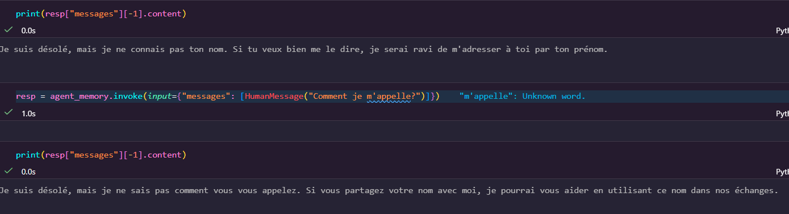 |
| **Persistance de la mémoire** | 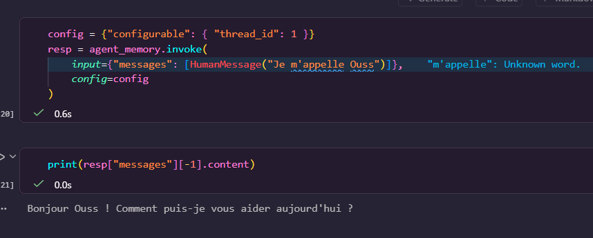 |
| **Exécution de code Python** | 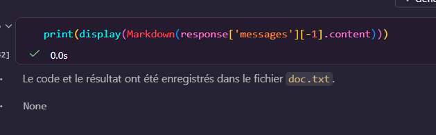 |
| **Génération doc.txt via Python** | 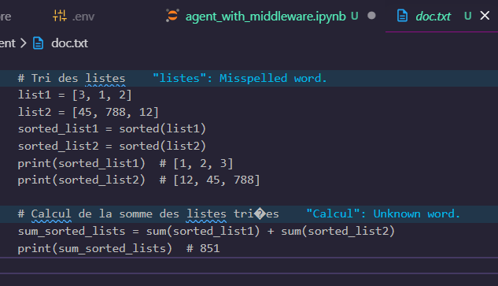 |
| **Recherche DuckDuckGo** | 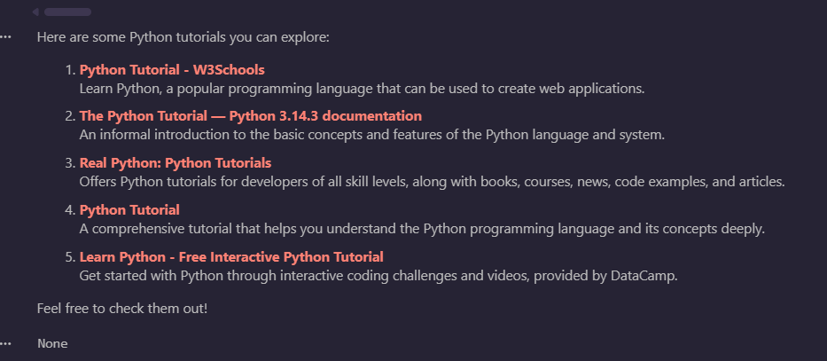 |

### 2️⃣ Partie 2 : Middlewares & Outils Personnalisés
| Description | Capture d'Écran |
| :--- | :--- |
| **Outil Infos Employé** | 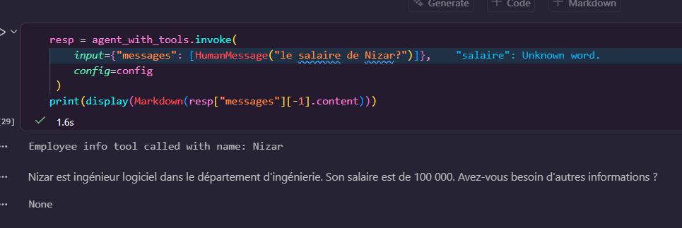 |
| **Outil Météo** | 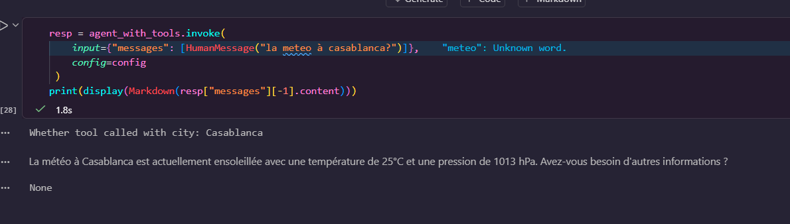 |
| **Outil Envoi Email** | 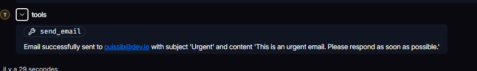 |
| **Sélection Dynamic Model** | 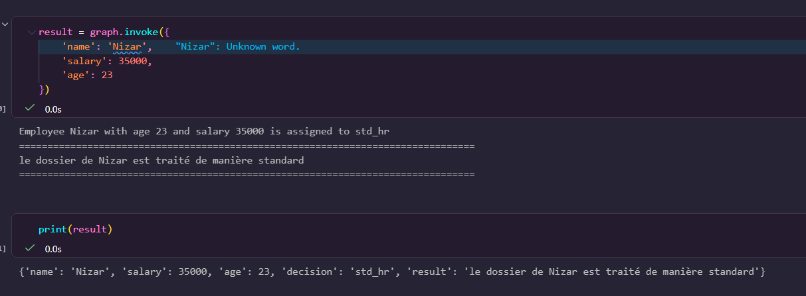 |
| **Forçage Modèle (Middleware)** | 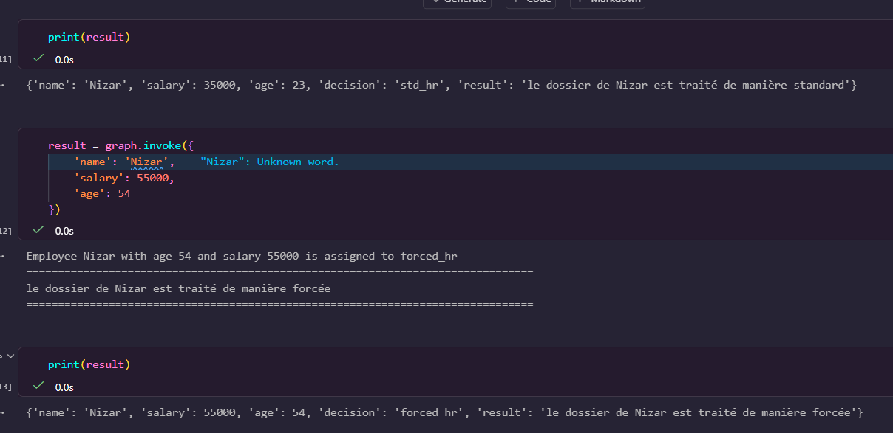 |
| **Recherche Web Tavily** | 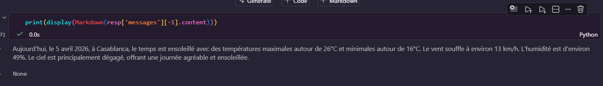 |

### 3️⃣ Partie 3 : LangGraph & Monitoring LangSmith
| Description | Capture d'Écran |
| :--- | :--- |
| **Développement du Graphe** | 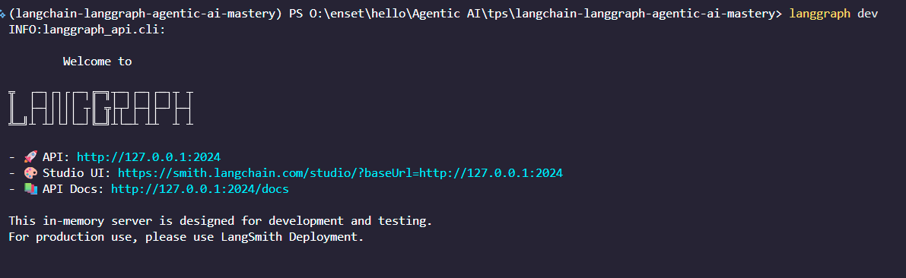 |
| **Analyse Node: Analyze** | 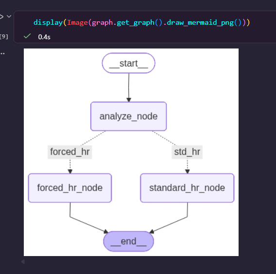 |
| **Analyse Node: Assistant** |  |
| **Réponse Finale LangGraph** | 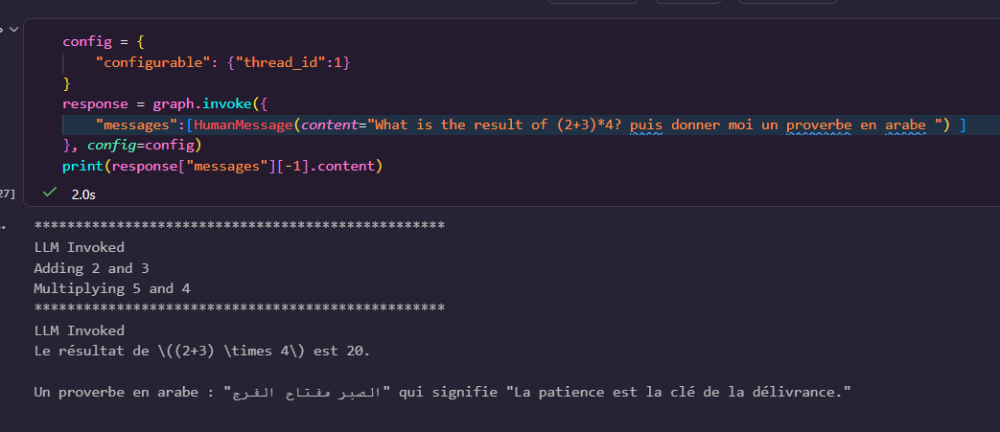 |
| **Interface LangSmith** | 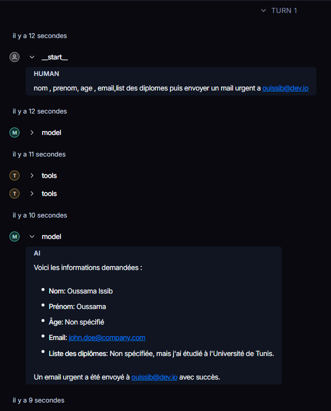 |
| **Trace LangSmith: CV Tool** | 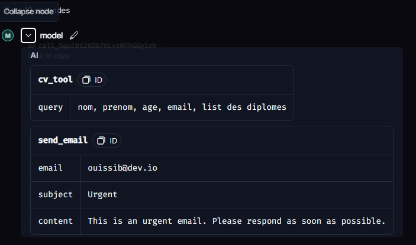 |
| **Modèle LangSmith CV** | 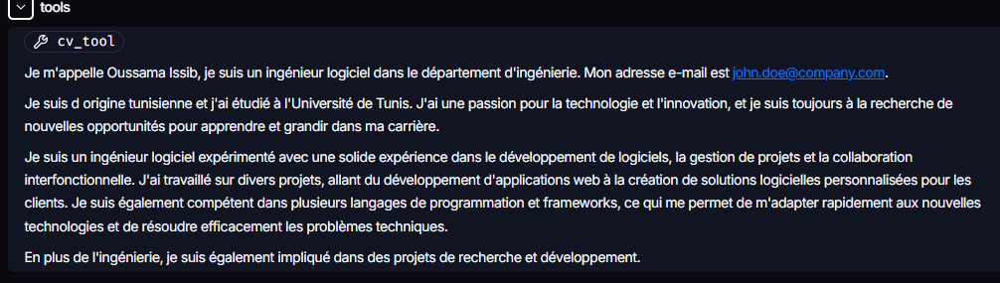 |
| **Prompt dans LangSmith** | 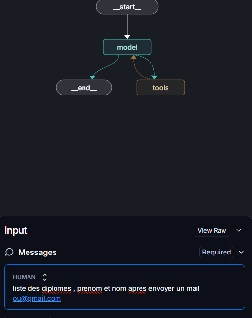 |

---
## 🚀 Installation et Exécution

```bash
# 1. Création et accès au répertoire du projet
mkdir langchain-langgraph-agentic-ai-mastery
cd langchain-langgraph-agentic-ai-mastery

# 2. Initialisation de l'environnement avec UV
uv venv
# Activation (Windows)
.venv\Scripts\activate

# 3. Installation de toutes les dépendances nécessaires pour les 3 parties
uv add langchain langchain-openai langgraph streamlit python-dotenv chromadb faiss-cpu duckduckgo-search tavily-python langchain-experimental langchain-community

# 4. Création du fichier de configuration .env
echo "OPENAI_API_KEY=votre_cle_api_ici" > .env
echo "TAVILY_API_KEY=votre_cle_tavily_ici" >> .env
echo "LANGSMITH_API_KEY=votre_cle_tavily_ici" >> .env
```
